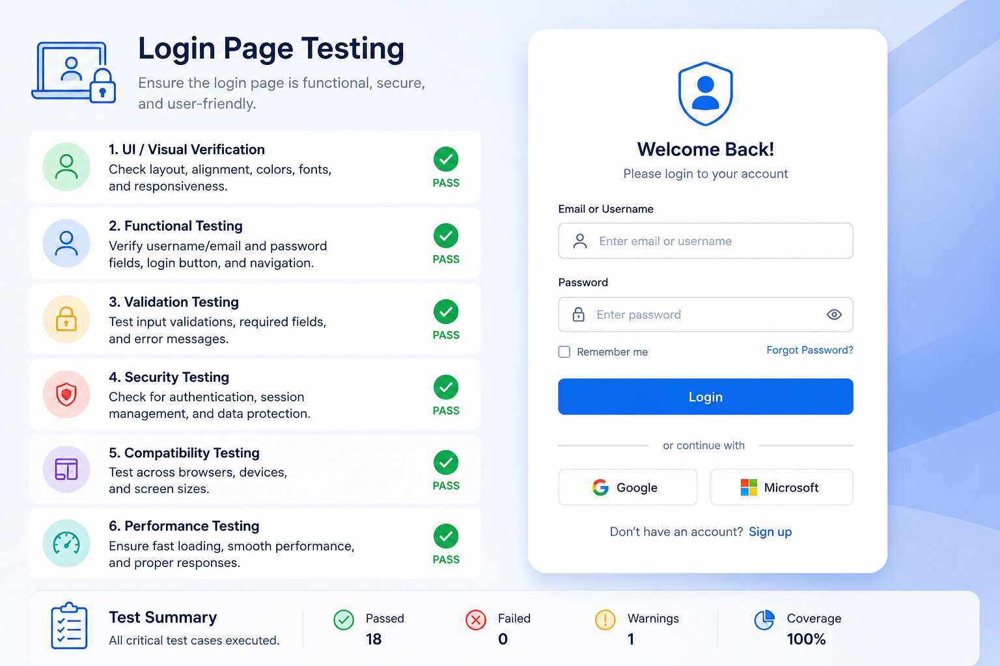

# 🔐 Login Page Testing

A complete manual testing project for validating Login Page functionality using positive, negative, and edge test scenarios.

---

## 🖼️ Project Screenshot

---

# 📋 Manual Test Cases

| Test Case |
|------------|
| Login with valid username and password |
| Login with valid username and invalid password |
| Login with invalid username and valid password |
| Login with both invalid username and password |
| Login with empty username field |
| Login with empty password field |
| Login with both username and password fields empty |
| Verify password masking functionality |
| Verify Forgot Password link functionality |
| Verify Remember Me checkbox functionality |
| Verify login using Enter key |
| Verify SQL Injection protection |
| Verify username/password case sensitivity |
| Verify handling of leading and trailing spaces |
| Verify maximum character limit validation |
| Verify special characters validation |
| Verify session timeout functionality |
| Verify multiple failed login attempts handling |
| Verify browser back button after logout |
| Verify responsive login page on mobile/tablet/desktop |

---
# ✅ Testing Types Covered

- Functional Testing
- Validation Testing
- Security Testing
- UI Testing
- Responsive Testing
- Negative Testing

## 👨‍💻 Author

**Vicky Kumar**
